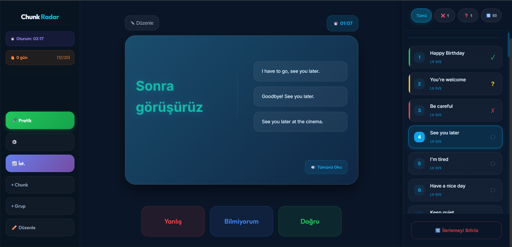

# 🎯 Chunk Radar

> A modern, interactive flashcard application for English learning using the **Chunking Method** with spaced repetition

[](https://github.com)
[](https://reactjs.org/)
[](https://www.typescriptlang.org/)
[](https://vitejs.dev/)

## About

**Chunk Radar** is an English learning application designed around the **chunking method** - a proven technique for language acquisition that focuses on learning phrases and word combinations as meaningful units rather than individual words.

This project features a modern, redesigned interface with persistent learning progress, smart filtering, and keyboard shortcuts for efficient studying.

## Screenshots




## Features

### � Smart Learning System
- **Spaced Repetition**: Automatically schedules reviews based on confidence levels (0-5)
- **Persistent Progress**: All learning data saved in `metadata.json` - pick up right where you left off
- **Confidence Tracking**: Every chunk shows its learning level (Lv 0/5 to Lv 5/5)
- **Smart Filtering**: Focus on what matters with intelligent chunk filters

### 🎨 Modern UI/UX
- **Three-Panel Layout**: 
  - Left sidebar for session controls
  - Center area for flashcard display
  - Right panel for chunk navigation
- **Interactive Flashcards**:
  - Single click → Play audio (TTS)
  - Double click → Flip card
  - Clean, centered text display
- **Redesigned Right Panel**:
  - Sticky filter bar with pill buttons
  - Spacious chunk cards with previews
  - Status indicators and confidence levels
  - Smooth scrolling navigation

### Keyboard Shortcuts
Speed up your learning with quick keyboard controls:
- **A** - Mark as Wrong (Yanlış)
- **S** - Skip (Bilmiyorum)
- **D** - Mark as Correct (Doğru)

*Note: Shortcuts only work when card is flipped and not typing in input fields*

### Advanced Tracking
- **Progress Dashboard**: Track correct/wrong/skipped answers
- **Daily Statistics**: Monitor learning patterns over time
- **Streak Counter**: Build and maintain learning streaks
- **Group Management**: Organize chunks into custom groups

### Focus Modes
Filter chunks based on your learning needs:
- **Tümü**: View all chunks
- **❌ Yanlışlar**: Only incorrect answers
- **❓ Bilinmeyenler**: Only skipped chunks
- **🔄 Tekrar Gerekli**: Low confidence (< 3) + wrong/skipped chunks

### Text-to-Speech
- Adjustable speech speed
- Multiple voice options
- Click to hear pronunciation

## Quick Start

### Prerequisites
- Node.js (v18+)
- npm or yarn

### Installation

```bash
# Clone the repository
git clone https://github.com/yourusername/chunk-radar.git
cd chunk-radar

# Install dependencies
npm install

# Start development servers
npm run dev      # Frontend (Vite) - http://localhost:5173
npm run server   # Backend (Express) - http://localhost:3001
```

### Usage

1. **Select a Group**: Choose from the top tabs (Günlük Popüler 1, 2, Software Popüler 1)
2. **Start Learning**: 
   - Single click on card → Hear pronunciation
   - Double click → See translation and examples
3. **Answer**:
   - Use buttons: ❌ Yanlış, ❓ Bilmiyorum, ✓ Doğru
   - OR use keyboard: **A** (Wrong), **S** (Skip), **D** (Correct)
4. **Track Progress**: 
   - View your progress in the right panel
   - Use filters to focus on specific chunks
   - Check confidence levels (Lv 0/5 to Lv 5/5)

### Focus Mode Usage
- **Tümü**: Practice all chunks in the group
- **❌ Yanlışlar**: Review only mistakes
- **❓ Bilinmeyenler**: Practice skipped items
- **🔄 Tekrar Gerekli**: Focus on weak chunks (low confidence or errors)

## Data Structure

### Chunk Format
```json
{
  "id": 1,
  "english": "Good morning",
  "turkish": "Günaydın",
  "examples": [
    "Good morning! How are you?",
    "Good morning mom.",
    "I said good morning to the teacher."
  ],
  "exampleTranslations": [
    "Günaydın! Nasılsın?",
    "Günaydın anne.",
    "Öğretmene günaydın dedim."
  ]
}
```

### Metadata Structure
All learning progress is stored in `src/data/metadata.json`:

```json
{
  "groups": [...],
  "stats": [...],
  "progress": {
    "default": {
      "4": "skipped",
      "30": "wrong",
      "46": "correct"
    }
  },
  "confidence": {
    "default": {
      "46": {
        "level": 1,
        "nextReview": "2026-02-03",
        "lastReviewed": "2026-02-01"
      }
    }
  }
}
```

**Confidence Levels**:
- **Level 0-1**: New or difficult chunks → Review frequently
- **Level 2-3**: Moderate chunks → Review periodically  
- **Level 4-5**: Well-known chunks → Review less often

## Technologies Used

- **React + TypeScript**: Modern UI with type safety
- **Vite**: Fast development and build tool
- **CSS Variables**: Consistent theming and styling
- **Express.js**: REST API backend
- **Web Speech API**: Text-to-speech functionality
- **JSON-based Storage**: Persistent local data

## Project Structure

```
chunk-radar/
├── src/
│   ├── data/
│   │   ├── metadata.json           # Progress + stats + confidence
│   │   ├── gnlk-popler-1.json     # Chunk group 1
│   │   ├── gnlk-popler-2.json     # Chunk group 2
│   │   └── software-popler-1.json  # Software chunks
│   ├── App.tsx                     # Main application
│   └── index.css                   # Global styles
├── server.js                       # Express backend
├── vite.config.ts                 # Vite configuration
└── package.json                   # Dependencies
```

## Design Philosophy

Chunk Radar embraces modern web design principles:

- **Glassmorphism**: Translucent cards with backdrop blur
- **Vibrant Gradients**: Blue-to-cyan accents
- **Smooth Animations**: CSS transitions and micro-interactions
- **Responsive Layout**: Optimized for desktop study sessions
- **Dark Theme**: Easy on the eyes for extended learning

## The Chunking Method

The chunking method is a language learning technique where you:

1. **Learn phrases as units** instead of individual words
2. **Focus on context** through example sentences
3. **Build natural fluency** by memorizing common combinations
4. **Track progress** with spaced repetition

Example chunk: "Turn on the light" → Natural phrase learning

## Contributing

Contributions are welcome! To add new chunks:

1. Edit the appropriate JSON file in `src/data/`
2. Follow the existing chunk format
3. Ensure translations are accurate
4. Test with the app before submitting

## API Endpoints

- `GET /api/groups` - Fetch all groups
- `POST /api/groups` - Create new group
- `PUT /api/groups/:id` - Update group name
- `DELETE /api/groups/:id` - Delete group
- `GET /api/chunks/:groupId` - Fetch chunks for group
- `POST /api/chunks` - Add new chunk
- `PUT /api/chunks/:groupId/:chunkId` - Update chunk
- `DELETE /api/chunks/:groupId/:chunkId` - Delete chunk
- `GET /api/stats` - Fetch statistics
- `POST /api/stats` - Record study session
- `GET /api/progress/:groupId` - Get progress
- `POST /api/progress` - Save progress
- `GET /api/confidence/:groupId` - Get confidence data
- `POST /api/confidence` - Update confidence

## License

MIT License - feel free to use this project for your own learning!

## Acknowledgments

- Built with the power of **Vibe-Coding**
- Inspired by modern flashcard apps (Anki, Quizlet)
- Designed for effective English language learning

---

**Happy Learning!**

*Master English one chunk at a time with Chunk Radar*
