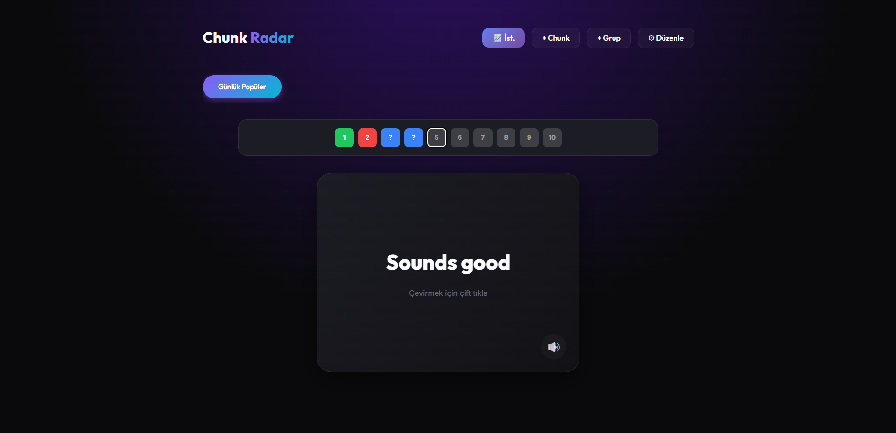
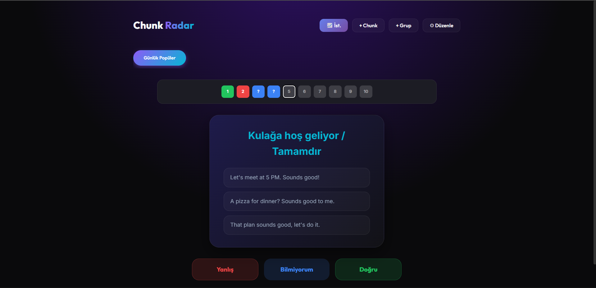
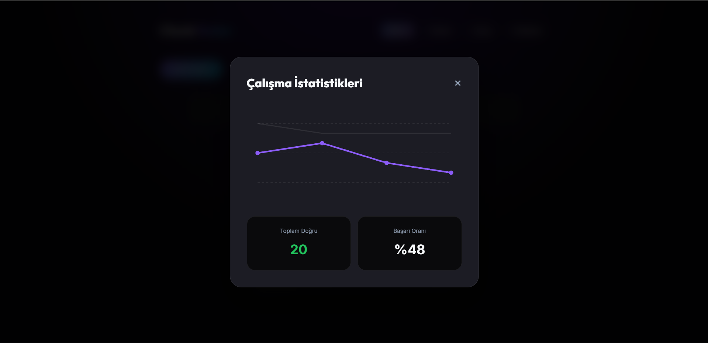

# 🎯 Chunk Radar

> A modern, interactive flashcard application for English learning using the **Chunking Method**

[](https://github.com)
[](https://reactjs.org/)
[](https://www.typescriptlang.org/)
[](https://vitejs.dev/)

## About

**Chunk Radar** is an English learning application designed around the **chunking method** - a proven technique for language acquisition that focuses on learning phrases and word combinations as meaningful units rather than individual words.

This project represents my first experience with **Vibe-Coding**, an AI-assisted development methodology that emphasizes rapid iteration, modern design patterns, and developer productivity.

## Screenshots





## Features

### 🎴 Modern Flashcard Interface
- **Single-click**: Play audio pronunciation (TTS)
- **Double-click**: Flip card to reveal translation
- Clean, distraction-free study environment

### Visual Progress Tracking
- **Mini-card navigation** with color-coded status:
  - 🟢 Green: Correct answers
  - 🔴 Red: Wrong answers
  - 🔵 Blue (?): Skipped/uncertain
  - ⚪ Gray: Not yet reviewed
- Click any mini-card to jump to that chunk

### Analytics Dashboard
- 30-day progress tracking
- Visual charts showing correct/wrong ratio
- Success rate percentage
- Statistics persist across deletions

### Flexible Organization
- Create custom chunk groups
- Modern pill-style tab navigation
- CRUD operations on groups and chunks
- Data persists locally via JSON

### Smart Answer Options
- **Doğru** (Correct): I know this
- **Yanlış** (Wrong): I need to review
- **Bilmiyorum** (I don't know): Skip but mark for review

## Quick Start

### Prerequisites
- Node.js (v18+)
- npm or yarn

### Installation

```bash
# Clone the repository
git clone https://github.com/yourusername/chunk-radar.git
cd chunk-radar

# Install dependencies
npm install

# Start development servers
npm run dev      # Frontend (Vite) - http://localhost:5173
npm run server   # Backend (Express) - http://localhost:3001
```

### Usage

1. **Create Groups**: Organize chunks by topic (e.g., "Daily Phrases", "Business English")
2. **Add Chunks**: Click "+ Chunk" to add new vocabulary with:
   - English phrase
   - Turkish translation
   - Example sentences
3. **Study**: 
   - Select a group tab
   - Single-click for pronunciation
   - Double-click to flip and see translation
   - Choose your answer (Correct/Wrong/Skip)
4. **Track Progress**: Click "📈 İst." to view your learning statistics

## Tech Stack

### Frontend
- **React 18** - UI library
- **TypeScript** - Type safety
- **Vite** - Build tool and dev server
- **CSS3** - Modern styling with gradients and animations

### Backend
- **Express.js** - REST API server
- **Node.js** - Runtime environment
- **File System (fs)** - JSON-based persistence

### Development Methodology
- **Vibe-Coding** - AI-assisted rapid development
- Modern design patterns
- Component-based architecture
- Real-time state management

## Project Structure

```
chunk-radar/
├── src/
│   ├── data/
│   │   ├── metadata.json      # Groups + 30-day stats (unified)
│   │   ├── chunks.json         # Default group chunks
│   │   └── [custom].json       # Custom group chunks
│   ├── App.tsx                 # Main application
│   └── index.css               # Global styles
├── server.js                   # Express backend
├── vite.config.ts             # Vite configuration
└── package.json               # Dependencies
```

## Design Philosophy

Chunk Radar embraces modern web design principles:

- **Glassmorphism**: Translucent cards with backdrop blur
- **Vibrant Gradients**: Purple-to-pink accents
- **Smooth Animations**: CSS transitions and transforms
- **Responsive Layout**: Mobile-first approach
- **Dark Theme**: Easy on the eyes for extended study sessions

## The Chunking Method

The chunking method is a language learning technique where you:

1. **Learn phrases as units** instead of individual words
2. **Focus on context** through example sentences
3. **Build natural fluency** by memorizing common combinations
4. **Track progress** with spaced repetition

Example chunk: "Break a leg" (theatrical good luck phrase)

## Built with Vibe-Coding

This project was developed using **Vibe-Coding**, leveraging AI assistance for:
- Rapid prototyping and iteration
- Modern UI/UX implementation
- Code quality and best practices
- Real-time problem solving

## Data Persistence

All data is stored locally in JSON format:

```json
{
  "groups": [
    { "id": "default", "name": "Daily Popular", "file": "chunks.json" }
  ],
  "stats": [
    { "date": "2026-01-17", "correct": 8, "wrong": 2, "total": 10 }
  ]
}
```

**Key Features:**
- Automatic migration from old format
- Stats preserved across chunk/group deletions
- 30-day rolling history
- Single source of truth

## Development

### Available Scripts

```bash
npm run dev      # Start Vite dev server
npm run server   # Start Express backend
npm run build    # Build for production
npm run preview  # Preview production build
```

### API Endpoints

- `GET /api/groups` - Fetch all groups
- `POST /api/groups` - Create new group
- `PUT /api/groups/:id` - Update group name
- `DELETE /api/groups/:id` - Delete group
- `GET /api/chunks/:groupId` - Fetch chunks for group
- `POST /api/chunks` - Add new chunk
- `PUT /api/chunks/:groupId/:chunkId` - Update chunk
- `DELETE /api/chunks/:groupId/:chunkId` - Delete chunk
- `GET /api/stats` - Fetch statistics
- `POST /api/stats` - Record study session

## 🎯 Roadmap

- [ ] Export/Import functionality
- [ ] Multiple language support
- [ ] Audio recording for pronunciation
- [ ] Spaced repetition algorithm
- [ ] Mobile app (React Native)
- [ ] Cloud sync

## License

MIT License - feel free to use this project for your own learning!

## Acknowledgments

- Built with the power of **Vibe-Coding**
- Inspired by modern flashcard apps
- Designed for effective English language learning

---

**Happy Learning!**

*Master English one chunk at a time with Chunk Radar*
